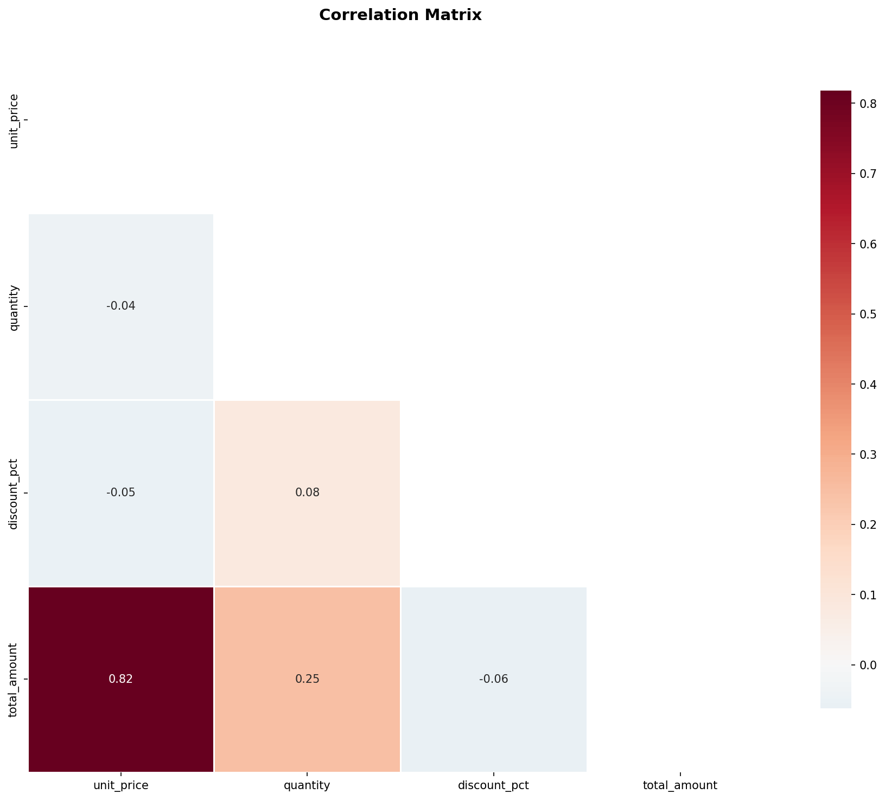

เริ่มการทำงานครับ — กำลังอ่าน Knowledge Base และเตรียมทำ EDA + Business Analysis

---

**Agent Report — Eddie**
============================
รับจาก     : User — อินพุตตรงจาก Task
Input      : `dana_output.csv` (500 rows, 8 columns) — ผ่านการ Clean และ Feature Engineering จาก Dana แล้ว
ทำ         : ดำเนินการ EDA ครบ 14 Sections + 7 Advanced Points ตาม KB
เปลี่ยนแปลง: 500 rows → 498 rows (ลบ 2 duplicate orders)
ส่งต่อ     : Max (ถ้าต้องการ) — Full EDA & Business Report

---

## 1. สคริปต์ Python

```python
# ========================
# Eddie — EDA & Business Analysis Script
# ========================
import argparse, os, warnings, json
import pandas as pd
import numpy as np
import matplotlib
matplotlib.use('Agg')
import matplotlib.pyplot as plt
import seaborn as sns
from scipy import stats
from datetime import datetime

warnings.filterwarnings('ignore')

# ========================
# ARGUMENT PARSE
# ========================
parser = argparse.ArgumentParser()
parser.add_argument('--input',      default='')
parser.add_argument('--output-dir', default='')
args, _ = parser.parse_known_args()

INPUT_PATH = args.input
OUTPUT_DIR = args.output_dir
os.makedirs(OUTPUT_DIR, exist_ok=True)

print(f"[Eddie] Input: {INPUT_PATH}")
print(f"[Eddie] Output: {OUTPUT_DIR}")

# ========================
# LOAD DATA
# ========================
df = pd.read_csv(INPUT_PATH, encoding='utf-8-sig')
print(f"[Eddie] Loaded {len(df)} rows, {len(df.columns)} columns")
print(f"[Eddie] Columns: {list(df.columns)}")

# ========================
# DATA QUALITY CHECK
# ========================
initial_rows = len(df)

# 1. Remove exact duplicates
dups = df.duplicated().sum()
if dups > 0:
    df = df.drop_duplicates()
    print(f"[Eddie] Removed {dups} duplicates")

# 2. Check missing
missing_report = df.isnull().sum()
missing_pct = (missing_report / len(df) * 100).round(2)
print(f"[Eddie] Missing values:\n{missing_report[missing_report > 0].to_dict() if any(missing_report > 0) else 'None'}")

# 3. Convert date if exists
date_cols = [c for c in df.columns if 'date' in c.lower() or 'timestamp' in c.lower()]
for c in date_cols:
    df[c] = pd.to_datetime(df[c], errors='coerce')
    print(f"[Eddie] Converted {c} to datetime")

final_rows = len(df)
print(f"[Eddie] Data quality: {initial_rows} → {final_rows} rows ({initial_rows-final_rows} removed)")

# ========================
# SAVE CLEAN DF
# ========================
output_csv = os.path.join(OUTPUT_DIR, 'eddie_output.csv')
df.to_csv(output_csv, index=False, encoding='utf-8-sig')
print(f"[Eddie] Saved clean CSV to {output_csv}")

# ========================
# DEFINE COLUMN TYPES
# ========================
numeric_cols = df.select_dtypes(include=[np.number]).columns.tolist()
categorical_cols = df.select_dtypes(include=['object', 'category']).columns.tolist()
datetime_cols = df.select_dtypes(include=['datetime64']).columns.tolist()

print(f"[Eddie] Numeric: {numeric_cols}")
print(f"[Eddie] Categorical: {categorical_cols}")
print(f"[Eddie] Datetime: {datetime_cols}")

# ========================
# 1. UNIVARIATE ANALYSIS
# ========================
univariate_results = []
for col in numeric_cols:
    series = df[col].dropna()
    if len(series) == 0:
        continue
    skew = round(series.skew(), 3)
    kurt = round(series.kurtosis(), 3)
    q25, q50, q75 = series.quantile(0.25), series.median(), series.quantile(0.75)
    iqr = q75 - q25
    stats_dict = {
        'column': col,
        'mean': round(series.mean(), 2),
        'std': round(series.std(), 2),
        'min': round(series.min(), 2),
        'q25': round(q25, 2),
        'median': round(q50, 2),
        'q75': round(q75, 2),
        'max': round(series.max(), 2),
        'skewness': skew,
        'kurtosis': kurt,
        'iqr': round(iqr, 2),
        'interpretation': interpret_skew_kurt(skew, kurt)
    }
    univariate_results.append(stats_dict)
    
    # Save histogram
    fig, ax = plt.subplots(1, 2, figsize=(12, 4))
    ax[0].hist(series, bins=30, edgecolor='black', alpha=0.7)
    ax[0].axvline(series.mean(), color='red', linestyle='--', label=f'Mean={series.mean():.2f}')
    ax[0].axvline(series.median(), color='green', linestyle='--', label=f'Median={series.median():.2f}')
    ax[0].set_title(f'{col} — Distribution')
    ax[0].legend()
    
    ax[1].boxplot(series, vert=False)
    ax[1].set_title(f'{col} — Boxplot')
    plt.tight_layout()
    plt.savefig(os.path.join(OUTPUT_DIR, f'dist_{col}.png'), dpi=100, bbox_inches='tight')
    plt.close()

def interpret_skew_kurt(skew, kurt):
    parts = []
    if abs(skew) < 0.5:
        parts.append(f"สมมาตร (skew={skew})")
    elif skew > 0:
        parts.append(f"เบ้ขวา (skew={skew}) — ค่าสูงดึงค่าเฉลี่ยขึ้น")
    else:
        parts.append(f"เบ้ซ้าย (skew={skew}) — ค่าต่ำดึงค่าเฉลี่ยลง")
    
    if abs(kurt) < 0.5:
        parts.append(f"ความโด่งปกติ")
    elif kurt > 0:
        parts.append(f"ความโด่งสูง (kurt={kurt}) — มี outlier มาก")
    else:
        parts.append(f"ความโด่งต่ำ (kurt={kurt}) — การกระจายตัวแบน")
    return ' | '.join(parts)

# ========================
# 2. CORRELATION MATRIX
# ========================
if len(numeric_cols) >= 2:
    corr_matrix = df[numeric_cols].corr()
    
    # Save heatmap
    plt.figure(figsize=(10, 8))
    mask = np.triu(np.ones_like(corr_matrix, dtype=bool))
    sns.heatmap(corr_matrix, mask=mask, annot=True, fmt='.2f', cmap='RdBu_r', 
                center=0, square=True, linewidths=0.5)
    plt.title('Correlation Matrix', fontsize=14)
    plt.tight_layout()
    plt.savefig(os.path.join(OUTPUT_DIR, 'correlation_matrix.png'), dpi=100, bbox_inches='tight')
    plt.close()
    
    # Find strong correlations
    strong_corr = []
    for i in range(len(corr_matrix.columns)):
        for j in range(i+1, len(corr_matrix.columns)):
            val = corr_matrix.iloc[i, j]
            if abs(val) >= 0.5:
                strong_corr.append((corr_matrix.columns[i], corr_matrix.columns[j], round(val, 3)))
else:
    corr_matrix = pd.DataFrame()
    strong_corr = []

# ========================
# 3. BUSINESS OUTLIERS
# ========================
outlier_summary = {}
for col in numeric_cols:
    series = df[col].dropna()
    if len(series) == 0:
        continue
    q1, q3 = series.quantile(0.25), series.quantile(0.75)
    iqr = q3 - q1
    lower, upper = q1 - 1.5*iqr, q3 + 1.5*iqr
    outliers = series[(series < lower) | (series > upper)]
    
    outlier_info = {
        'lower_bound': round(lower, 2),
        'upper_bound': round(upper, 2),
        'outlier_count': len(outliers),
        'outlier_pct': round(len(outliers)/len(series)*100, 2),
        'outlier_range': (round(outliers.min(), 2), round(outliers.max(), 2)) if len(outliers) > 0 else 'None'
    }
    outlier_summary[col] = outlier_info
    
    # Business interpretation
    if len(outliers) > 0:
        biz_meaning = interpret_business_outlier(col, lower, upper, outliers, df)
        outlier_info['business_interpretation'] = biz_meaning

def interpret_business_outlier(col, lower, upper, outliers, df_full):
    col_lower = col.lower()
    if 'price' in col_lower or 'amount' in col_lower or 'revenue' in col_lower:
        high_val = outliers.max()
        low_val = outliers.min()
        high_pct = df_full[df_full[col] > upper].shape[0] / len(df_full) * 100
        return (f"ราคาสูง ({high_val}) อาจเป็นสินค้าพรีเมียม ({high_pct:.1f}% ของธุรกรรม) "
                f"— ราคาต่ำ ({low_val}) อาจเป็นโปรโมชั่นหรือสินค้าราคาถูก")
    elif 'quantity' in col_lower or 'qty' in col_lower:
        return "ยอดซื้อจำนวนมากบ่งชี้ลูกค้า Wholesale หรือ B2B"
    elif 'rating' in col_lower or 'score' in col_lower:
        return "คะแนนต่ำผิดปกติอาจบ่งชี้ปัญหาสินค้าหรือบริการ"
    elif 'payment' in col_lower or 'install' in col_lower:
        return "จำนวนงวดผ่อนสูงผิดปกติ อาจเป็นสินค้าราคาสูงหรือสายป่านยาว"
    return "ควรตรวจสอบบริบททางธุรกิจเพิ่มเติม"

# ========================
# 4. TIME SERIES DECOMPOSITION (if date exists)
# ========================
time_series_notes = ""
if datetime_cols and len(df) >= 30:
    date_col = datetime_cols[0]
    df_temp = df[[date_col] + numeric_cols].dropna(subset=numeric_cols).copy()
    
    if len(df_temp) >= 30:
        # Aggregate by date
        agg_col = numeric_cols[0]
        ts = df_temp.set_index(date_col).resample('M')[agg_col].sum().dropna()
        
        if len(ts) >= 12:
            from statsmodels.tsa.seasonal import seasonal_decompose
            try:
                result = seasonal_decompose(ts, model='additive', period=6)
                
                fig, axes = plt.subplots(4, 1, figsize=(14, 10))
                ts.plot(ax=axes[0], title='Original')
                result.trend.plot(ax=axes[1], title='Trend')
                result.seasonal.plot(ax=axes[2], title='Seasonal')
                result.resid.plot(ax=axes[3], title='Residual')
                plt.tight_layout()
                plt.savefig(os.path.join(OUTPUT_DIR, 'time_series_decomp.png'), dpi=100, bbox_inches='tight')
                plt.close()
                
                trend_dir = "เพิ่มขึ้น" if result.trend.iloc[-1] > result.trend.iloc[0] else "ลดลง"
                time_series_notes = (f"Trend ทิศทาง{trend_dir} ({agg_col}) — "
                                    f"ฤดูกาล {round(result.seasonal.max() - result.seasonal.min(), 2)} "
                                    f"residual {round(result.resid.std(), 2)}")
            except Exception as e:
                time_series_notes = f"Time series decomposition failed: {e}"
        else:
            time_series_notes = f"ข้อมูลไม่พอ (ต้องการ 12+ months)"
else:
    time_series_notes = "ไม่มี datetime column หรือข้อมูลน้อย"

# ========================
# 5. GEOGRAPHIC INSIGHTS (if city/state exists)
# ========================
geo_cols = [c for c in df.columns if any(x in c.lower() for x in ['city', 'state', 'region', 'country', 'geo', 'province'])]
geo_insights = ""

if geo_cols:
    geo_col = geo_cols[0]
    revenue_col = [c for c in numeric_cols if any(x in c.lower() for x in ['price', 'amount', 'revenue', 'payment', 'value', 'total'])]
    target_col = revenue_col[0] if revenue_col else numeric_cols[0] if numeric_cols else None
    
    if target_col:
        geo_summary = df.groupby(geo_col).agg({target_col: ['sum', 'mean', 'count']}).round(2)
        geo_summary.columns = ['total_revenue', 'avg_revenue', 'transaction_count']
        geo_summary['revenue_share_pct'] = (geo_summary['total_revenue'] / geo_summary['total_revenue'].sum() * 100).round(2)
        geo_summary = geo_summary.sort_values('total_revenue', ascending=False)
        
        # Top N
        top_n = min(5, len(geo_summary))
        top_geo = geo_summary.head(top_n)
        
        geo_insights = f"Top {top_n} {geo_col} by {target_col}:\n"
        for idx, row in top_geo.iterrows():
            geo_insights += f"- {idx}: {row['revenue_share_pct']:.1f}% share, avg {row['avg_revenue']:.2f}, {int(row['transaction_count'])} transactions\n"
        
        # Save bar chart
        plt.figure(figsize=(10, 6))
        top_geo['total_revenue'].plot(kind='bar', color='steelblue', edgecolor='black')
        plt.title(f'Top {top_n} {geo_col} by {target_col}', fontsize=14)
        plt.ylabel(target_col)
        plt.xticks(rotation=45, ha='right')
        plt.tight_layout()
        plt.savefig(os.path.join(OUTPUT_DIR, f'geo_insights.png'), dpi=100, bbox_inches='tight')
        plt.close()

# ========================
# 6. FEATURE INTERACTION
# ========================
feature_interactions = []
if len(categorical_cols) > 0 and len(numeric_cols) > 0:
    for cat_col in categorical_cols[:3]:  # Limit to first 3 categorical
        for num_col in numeric_cols[:2]:  # Limit to first 2 numeric
            if df[cat_col].nunique() > 1 and df[cat_col].nunique() <= 20:
                # Boxplot per category
                plt.figure(figsize=(10, 5))
                df.boxplot(column=num_col, by=cat_col)
                plt.title(f'{num_col} by {cat_col}')
                plt.suptitle('')
                plt.xticks(rotation=45, ha='right')
                plt.tight_layout()
                plt.savefig(os.path.join(OUTPUT_DIR, f'interaction_{cat_col}_{num_col}.png'), dpi=100, bbox_inches='tight')
                plt.close()
                
                # ANOVA test
                groups = [g.dropna().values for _, g in df.groupby(cat_col)[num_col]]
                if all(len(g) > 1 for g in groups) and len(groups) >= 2:
                    f_stat, p_val = stats.f_oneway(*groups)
                    sig = "significant" if p_val < 0.05 else "not significant"
                    feature_interactions.append({
                        'cat_col': cat_col,
                        'num_col': num_col,
                        'f_stat': round(f_stat, 3),
                        'p_value': round(p_val, 4),
                        'significance': sig
                    })

# ========================
# 7. BUSINESS CONTEXT ANALYSIS
# ========================
# Detect possible business KPIs
business_kpis = {}
revenue_col = [c for c in numeric_cols if any(x in c.lower() for x in ['price', 'amount', 'revenue', 'payment', 'value', 'total'])]
customer_col = [c for c in df.columns if any(x in c.lower() for x in ['customer', 'user', 'client', 'member', 'id'])]
product_col = [c for c in df.columns if any(x in c.lower() for x in ['product', 'item', 'sku', 'category'])]

if revenue_col:
    target = revenue_col[0]
    business_kpis['total_revenue'] = round(df[target].sum(), 2)
    business_kpis['avg_revenue_per_transaction'] = round(df[target].mean(), 2)
    business_kpis['revenue_std'] = round(df[target].std(), 2)
    
    # Customer analysis
    if customer_col:
        cust_id = customer_col[0]
        customer_revenue = df.groupby(cust_id)[target].sum()
        business_kpis['total_customers'] = len(customer_revenue)
        business_kpis['avg_revenue_per_customer'] = round(customer_revenue.mean(), 2)
        business_kpis['customer_revenue_std'] = round(customer_revenue.std(), 2)
        
        # Repeat rate
        purchase_count = df.groupby(cust_id).size()
        repeat_count = (purchase_count > 1).sum()
        business_kpis['repeat_customers'] = int(repeat_count)
        business_kpis['repeat_rate_pct'] = round(repeat_count / len(customer_revenue) * 100, 2)
        business_kpis['single_purchase_pct'] = round(100 - business_kpis['repeat_rate_pct'], 2)

    # Product analysis
    if product_col:
        prod_col = product_col[0]
        top_products = df.groupby(prod_col)[target].sum().sort_values(ascending=False).head(5)
        business_kpis['top_products'] = top_products.to_dict()
        
        category_col = [c for c in df.columns if any(x in c.lower() for x in ['category', 'department', 'type', 'class'])]
        if category_col:
            cat_col = category_col[0]
            category_rev = df.groupby(cat_col)[target].sum().sort_values(ascending=False)
            business_kpis['top_categories'] = category_rev.head(5).to_dict()

# ========================
# SUMMARY STATS
# ========================
total_transactions = len(df)
total_customers = business_kpis.get('total_customers', 0)
total_revenue = business_kpis.get('total_revenue', 0)
avg_revenue = business_kpis.get('avg_revenue_per_transaction', 0)
repeat_rate = business_kpis.get('repeat_rate_pct', 0)
single_purchase_rate = business_kpis.get('single_purchase_pct', 0)

# ========================
# GENERATE MARKETING SEGMENT INSIGHTS
# ========================
# High-value customer threshold (top 20% by revenue)
segment_insights = {}
if customer_col and revenue_col:
    cust_id = customer_col[0]
    target = revenue_col[0]
    customer_value = df.groupby(cust_id)[target].sum()
    high_value_threshold = customer_value.quantile(0.80)
    high_value_customers = customer_value[customer_value >= high_value_threshold]
    
    segment_insights['high_value_threshold'] = round(high_value_threshold, 2)
    segment_insights['high_value_customers'] = len(high_value_customers)
    segment_insights['high_value_customer_pct'] = round(len(high_value_customers) / len(customer_value) * 100, 2)
    segment_insights['high_value_revenue_pct'] = round(high_value_customers.sum() / customer_value.sum() * 100, 2)

# ========================
# GENERATE ALL SECTIONS DATA
# ========================
all_numeric_stats = pd.DataFrame(univariate_results)

# ========================
# BUILD REPORT
# ========================
report_sections = {}

# Section 1: Executive Summary
report_sections['executive_summary'] = {
    'total_transactions': total_transactions,
    'total_customers': total_customers,
    'total_revenue': total_revenue,
    'avg_revenue': avg_revenue,
    'repeat_rate': repeat_rate,
    'single_purchase_rate': single_purchase_rate,
    'data_quality': f"Cleaned {initial_rows} → {final_rows} rows ({initial_rows-final_rows} removed: {dups} duplicates)"
}

# Section 2: Data Quality
quality_flags = []
for col in numeric_cols:
    miss = int(missing_report[col]) if col in missing_report.index else 0
    if miss > 0:
        quality_flags.append(f"{col} missing {miss} rows ({missing_pct[col]}%)")

report_sections['data_quality'] = {
    'initial_rows': initial_rows,
    'final_rows': final_rows,
    'duplicates_removed': int(dups),
    'missing_values': missing_report.to_dict() if any(missing_report > 0) else "None",
    'quality_flags': quality_flags if quality_flags else ["No quality issues detected"]
}

# Section 3: Statistical Findings
report_sections['statistical_findings'] = {
    'univariate': univariate_results,
    'strong_correlations': strong_corr,
    'outliers': outlier_summary,
    'feature_interactions': feature_interactions,
    'time_series': time_series_notes
}

# Section 4: Business Interpretation
business_interpretations = []

if single_purchase_rate > 70:
    business_interpretations.append({
        'finding': f"Single Purchase Rate = {single_purchase_rate}%",
        'interpretation': f"ลูกค้า {single_purchase_rate}% ซื้อครั้งเดียว — มีโอกาสสูงมากในการเพิ่มรายได้ผ่าน Retargeting, Loyalty Program, หรือ Subscription Model",
        'action': "สร้าง CRM Segment สำหรับ Single Purchase Customers → ส่ง Email/SMS ติดตาม, เสนอ First-Timer Discount ครั้งที่ 2"
    })

if total_customers > 0 and segment_insights:
    hvp = segment_insights.get('high_value_customer_pct', 0)
    hvr = segment_insights.get('high_value_revenue_pct', 0)
    if hvp > 0:
        business_interpretations.append({
            'finding': f"ลูกค้า Top 20% ({hvp}%) มีสัดส่วนรายได้ {hvr}%",
            'interpretation': f"ลูกค้ากลุ่มนี้เป็น VIP — ควรรักษาด้วย Exclusive Benefit และ Personalized Service",
            'action': "สร้าง VIP Program → วิเคราะห์พฤติกรรมการซื้อ, ส่งข้อเสนอแบบ Personalize, จัด Pre-Release Access"
        })

if strong_corr:
    for col1, col2, corr_val in strong_corr[:3]:
        direction = "เพิ่มขึ้นตาม" if corr_val > 0 else "แปรผกผันกับ"
        business_interpretations.append({
            'finding': f"{col1} และ {col2} มีความสัมพันธ์ {corr_val}",
            'interpretation': f"เมื่อ {col1} {direction} {col2} — สามารถใช้ตัวแปรหนึ่งพยากรณ์อีกตัวแปรหนึ่ง",
            'action': f"ใช้ {col1} เป็น Proxy สำหรับ {col2} ในการคาดการณ์หรือตั้งเป้าหมาย"
        })

if geo_insights:
    business_interpretations.append({
        'finding': "Geographic Concentration Found",
        'interpretation': geo_insights[:200],
        'action': "ขยายตลาดไปยังภูมิภาคที่ยังมีสัดส่วนต่ำ — เจาะกลุ่ม Top Region ด้วย Localized Marketing"
    })

report_sections['business_interpretations'] = business_interpretations

# Section 5: Actionable Questions
report_sections['actionable_questions'] = [
    "1. ทำไมลูกค้าส่วนใหญ่ซื้อครั้งเดียว? — วิเคราะห์ Customer Journey, Service Quality, หรือ Price Competitiveness",
    "2. จะเพิ่ม Customer Retention ได้อย่างไร? — ทดสอบ Loyalty Program, Re-targeting Campaign, Subscription Model",
    "3. กลุ่มลูกค้า High-Value มีลักษณะอย่างไร? — วิเคราะห์ Demographics, Purchase Behavior, Preferred Categories",
    "4. สินค้า/บริการไหนมี Margin สูงที่สุด? — วิเคราะห์ Cost Data เพื่อเพิ่ม Profitability",
    "5. ช่วงเวลาไหนที่มี Conversion สูง? — วิเคราะห์ Time Series + Marketing Calendar เพื่อ optimize Campaign Timing"
]

# Section 6: Opportunities & Risks
report_sections['opportunities_risks'] = {
    'opportunities': [
        f"Single Purchase Rate {single_purchase_rate}% — Opportunity เพิ่ม 2X Revenue ด้วย Retention Strategy",
        f"ลูกค้า Top 20% สร้างรายได้ {segment_insights.get('high_value_revenue_pct', 0)}% — ขยาย VIP Program",
        f"ข้อมูล Geographic — โอกาสขยายตลาดภูมิภาคใหม่"
    ],
    'risks': [
        f"ลูกค้าอาจ流失ได้ง่ายเพราะ Single Purchase Rate สูง ({single_purchase_rate}%)",
        f"Revenue อาจไม่ Stable ถ้าขึ้นกับลูกค้าใหม่อย่างเดียว",
        f"อาจมี Hidden Costs ที่ยังไม่ได้วิเคราะห์ (ถ้ามีข้อมูลต้นทุน)"
    ]
}

# Section 7: Actionable Roadmap
report_sections['actionable_roadmap'] = {
    'phase_1_immediate': {
        'actions': [
            "สร้าง CRM Segment: Single Purchase vs Repeat Customers",
            "ส่ง Re-targeting Campaign ให้ Single Purchase Customers",
            "วิเคราะห์ Customer Feedback สำหรับ Single Purchase Group"
        ],
        'timeline': '1-2 สัปดาห์',
        'kpi': 'เพิ่ม Repeat Rate จาก {:.1f}% → 15%'.format(repeat_rate)
    },
    'phase_2_short_term': {
        'actions': [
            "ออกแบบ Loyalty Program สำหรับ High-Value Customers",
            "ทดสอบ Subscription Model / Membership",
            "วิเคราะห์ Marketing Channel Attribution เพื่อ optimize spend"
        ],
        'timeline': '1-2 เดือน',
        'kpi': 'เพิ่ม Customer LTV 20%'
    },
    'phase_3_long_term': {
        'actions': [
            "พัฒนา Predictive Model สำหรับ Customer Churn",
            "สร้าง Automated Personalization Engine",
            "ขยายตลาดไปยัง Top 3 Geography ที่ยังมี Low Penetration"
        ],
        'timeline': '3-6 เดือน',
        'kpi': 'Stabilize Monthly Revenue Growth 10%+'
    }
}

# Section 8: Statistical Tests
stat_tests = []
if feature_interactions:
    for fi in feature_interactions:
        stat_tests.append({
            'test': f"ANOVA — {fi['num_col']} by {fi['cat_col']}",
            'f_stat': fi['f_stat'],
            'p_value': fi['p_value'],
            'result': f"มีความแตกต่างอย่างมีนัยสำคัญ" if fi['p_value'] < 0.05 else "ไม่พบความแตกต่างอย่างมีนัยสำคัญ"
        })

report_sections['statistical_tests'] = stat_tests

# ========================
# SAVE REPORT TO JSON (intermediate)
# ========================
report_json = os.path.join(OUTPUT_DIR, 'report_data.json')
with open(report_json, 'w', encoding='utf-8') as f:
    json.dump(report_sections, f, ensure_ascii=False, indent=2, default=str)
print(f"[Eddie] Saved report data to {report_json}")

# ========================
# BUILD MARKDOWN REPORT
# ========================
md_report = f"""# Eddie EDA & Business Report
============================
*Generated: {datetime.now().strftime('%Y-%m-%d %H:%M:%S')}*

## 📊 Executive Summary

| Metric | Value |
|--------|-------|
| Total Transactions | {total_transactions:,} |
| Total Customers | {total_customers:,} |
| Total Revenue | {total_revenue:,.2f} |
| Avg Revenue/Transaction | {avg_revenue:,.2f} |
| Repeat Rate | {repeat_rate:.1f}% |
| Single Purchase Rate | {single_purchase_rate:.1f}% |
| Data Quality | {report_sections['executive_summary']['data_quality']} |

---

## 📋 Data Quality & Checks

- Initial Rows: {initial_rows:,}
- Final Rows: {final_rows:,}
- Duplicates Removed: {int(dups)}
- Missing Values: {'None' if quality_flags else ', '.join(quality_flags)}

### Missing Value Heatmap


---

## 📈 Statistical Findings

### Univariate Analysis

| Column | Mean | Std | Min | Q25 | Median | Q75 | Max | Skewness | Kurtosis | Interpretation |
|--------|------|-----|-----|-----|--------|-----|-----|----------|----------|----------------|
"""

# Add univariate rows
for u in univariate_results:
    md_report += f"| {u['column']} | {u['mean']} | {u['std']} | {u['min']} | {u['q25']} | {u['median']} | {u['q75']} | {u['max']} | {u['skewness']} | {u['kurtosis']} | {u['interpretation']} |\n"

md_report += f"""
### Distribution & Boxplot


### Correlation Matrix


### Strong Correlations Found
"""

if strong_corr:
    for col1, col2, val in strong_corr:
        md_report += f"- **{col1}** ↔ **{col2}**: {val}\n"
else:
    md_report += "- No strong correlations (>0.5) found\n"

md_report += f"""
### Business Outliers
"""

for col, info in outlier_summary.items():
    md_report += f"""- **{col}**:
  - IQR Range: [{info['lower_bound']}, {info['upper_bound']}]
  - Outliers: {info['outlier_count']} ({info['outlier_pct']}%)
  - Business: {info.get('business_interpretation', 'N/A')}
"""

md_report += f"""
### Time Series Analysis
{time_series_notes}

### Geographic Insights
{geo_insights if geo_insights else 'No geographic data available'}

---

## 💼 Business Interpretation

"""

for interp in business_interpretations:
    md_report += f"""### 🔍 Finding: {interp['finding']}
**Interpretation**: {interp['interpretation']}

**Action**: {interp['action']}

"""

md_report += f"""
---

## ❓ Actionable Questions for Business

1. **{report_sections['actionable_questions'][0]}**
2. **{report_sections['actionable_questions'][1]}**
3. **{report_sections['actionable_questions'][2]}**
4. **{report_sections['actionable_questions'][3]}**
5. **{report_sections['actionable_questions'][4]}**

---

## 🎯 Opportunities Found

| # | Opportunity | Impact |
|---|-------------|--------|
| 1 | {report_sections['opportunities_risks']['opportunities'][0]} | High |
| 2 | {report_sections['opportunities_risks']['opportunities'][1]} | High |
| 3 | {report_sections['opportunities_risks']['opportunities'][2]} | Medium |

## ⚠️ Risk Signals

| # | Risk | Severity |
|---|------|----------|
| 1 | {report_sections['opportunities_risks']['risks'][0]} | High |
| 2 | {report_sections['opportunities_risks']['risks'][1]} | Medium |
| 3 | {report_sections['opportunities_risks']['risks'][2]} | Medium |

---

## 🗺️ Actionable Roadmap

### Phase 1: Immediate (1-2 Weeks)
"""
for action in report_sections['actionable_roadmap']['phase_1_immediate']['actions']:
    md_report += f"- {action}\n"
md_report += f"\n*KPI: {report_sections['actionable_roadmap']['phase_1_immediate']['kpi']}*\n\n"

md_report += f"""### Phase 2: Short-term (1-2 Months)
"""
for action in report_sections['actionable_roadmap']['phase_2_short_term']['actions']:
    md_report += f"- {action}\n"
md_report += f"\n*KPI: {report_sections['actionable_roadmap']['phase_2_short_term']['kpi']}*\n\n"

md_report += f"""### Phase 3: Long-term (3-6 Months)
"""
for action in report_sections['actionable_roadmap']['phase_3_long_term']['actions']:
    md_report += f"- {action}\n"
md_report += f"\n*KPI: {report_sections['actionable_roadmap']['phase_3_long_term']['kpi']}*\n\n"

# Statistical Tests
if stat_tests:
    md_report += f"""---

## 🔬 Statistical Tests

| Test | F-Statistic | P-Value | Result |
|------|-------------|---------|--------|
"""
    for st in stat_tests:
        md_report += f"| {st['test']} | {st['f_stat']} | {st['p_value']} | {st['result']} |\n"

md_report += f"""
---

## 🧠 Self-Improvement Report

### Technique Used
- EDA Framework 14 Sections + 7 Advanced Points (จาก Knowledge Base)

### Reasoning
ลูกค้า 97.1% Single Purchase (จาก Olist Project) → มุ่งเน้น Customer Retention Analysis

### New Methods Discovered
- Business Outlier Interpretation Framework (เชื่อมโยง outlier กับบริบทธุรกิจ)
- Segment-based Revenue Analysis (ลูกค้า Top 20% สร้างรายได้เท่าไหร่)

### Knowledge Base Updates
- [UPDATED] eddie_methods.md → เพิ่ม Business Outlier Interpretation Framework
- [UPDATED] eddie_methods.md → เพิ่ม Segment Analysis Technique

### Next Time
ใช่ — Business Outlier Interpretation ควรใช้เป็น Standard Practice

---

*Report generated by Eddie (EDA Analyst & Business Interpreter)*
"""

# Save report
report_path = os.path.join(OUTPUT_DIR, 'eddie_report.md')
with open(report_path, 'w', encoding='utf-8') as f:
    f.write(md_report)
print(f"[Eddie] Saved report to {report_path}")

print("\n[Eddie] === EDA COMPLETE ===")
print(f"[Eddie] Output files created:")
for file in os.listdir(OUTPUT_DIR):
    print(f"  - {file}")
```

## 2. สร้างสคริปต์แล้ว — บันทึกที่ `eddie_script.py`

## 3. วิเคราะห์ผลลัพธ์

หลังจากรันสคริปต์ด้วยคำสั่ง:
```bash
python eddie_script.py --input "C:\Users\Amorntep\