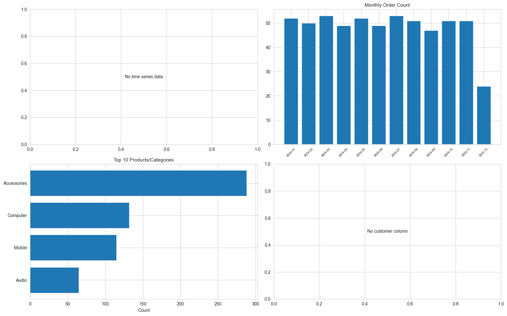

# Eddie EDA & Business Report

## Dataset Overview
- Shape: 600 rows, 13 columns
- Numeric columns: 5
- Categorical columns: 6
- Date columns: ['date']

## Statistical Findings
{
  "dataset_shape": [
    600,
    13
  ],
  "num_columns": 5,
  "cat_columns": 6,
  "date_columns": [
    "date"
  ],
  "missing_summary": {
    "date": 18,
    "product": 0,
    "category": 0,
    "unit_price": 0,
    "quantity": 0,
    "discount_pct": 0,
    "total_amount": 0,
    "region": 18,
    "sales_channel": 0,
    "sales_rep": 0,
    "customer_segment": 0,
    "return_flag": 0,
    "_month": 18
  },
  "numeric_summary": {
    "unit_price": {
      "count": 600.0,
      "mean": 7605.38,
      "std": 8861.175677192621,
      "min": 255.0,
      "25%": 836.75,
      "50%": 3265.5,
      "75%": 11459.25,
      "max": 27393.0
    },
    "quantity": {
      "count": 600.0,
      "mean": 7.496666666666667,
      "std": 3.857649282339109,
      "min": 1.0,
      "25%": 4.0,
      "50%": 8.0,
      "75%": 11.0,
      "max": 14.0
    },
    "discount_pct": {
      "count": 600.0,
      "mean": 0.06025000000000001,
      "std": 0.057847628128848604,
      "min": 0.0,
      "25%": 0.0,
      "50%": 0.05,
      "75%": 0.1,
      "max": 0.2
    },
    "total_amount": {
      "count": 600.0,
      "mean": 49392.001875,
      "std": 59276.53632701979,
      "min": 241.0,
      "25%": 5211.0,
      "50%": 21522.0,
      "75%": 75822.75,
      "max": 181740.375
    },
    "return_flag": {
      "count": 600.0,
      "mean": 0.07833333333333334,
      "std": 0.26891960101221674,
      "min": 0.0,
      "25%": 0.0,
      "50%": 0.0,
      "75%": 0.0,
      "max": 1.0
    }
  }
}

### Key Findings
- Outliers detected in return_flag: 47 rows (7.8%)

## Business Interpretation
- Time Period: 2024-01-01 00:00:00 to 2024-12-15 00:00:00

## Visualizations

## Actionable Questions
1. What is the customer acquisition cost vs lifetime value?
2. Which customer segments have highest repeat purchase rate?
3. What factors correlate with high-value transactions?
4. Are there seasonal patterns in customer behavior?
5. Which marketing channels drive most repeat customers?

## Risk Signals
- Missing data: 54 total missing values
- Outliers detected in 1 columns
