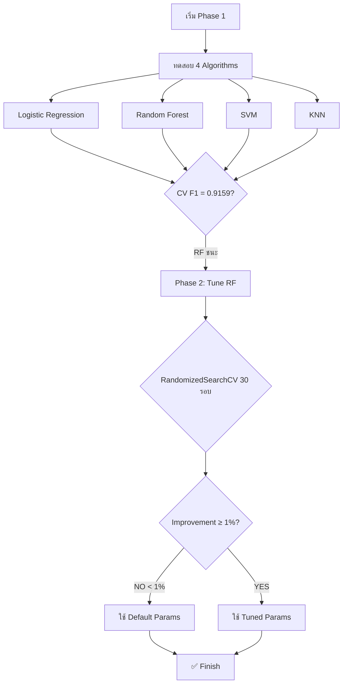
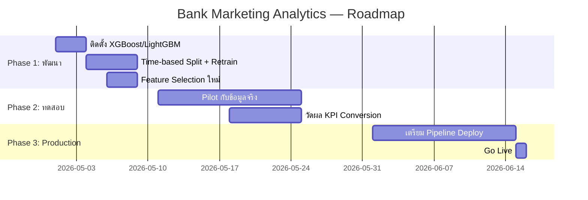

# 📊 รายงานนำเสนอที่ประชุม
## Bank Marketing Campaign Analytics  
### วันที่: 29 เมษายน 2026

---

## สารบัญ

1. [เราทำอะไรไปบ้าง?](#1-เราทำอะไรไปบ้าง)
2. [ผลลัพธ์ที่ได้](#2-ผลลัพธ์ที่ได้)
3. [ทำไมถึงเลือกวิธีนี้?](#3-ทำไมถึงเลือกวิธีนี้)
4. [ประโยชน์กับธุรกิจ](#4-ประโยชน์กับธุรกิจ)
5. [สรุปผู้บริหาร](#5-สรุปผู้บริหาร)

---

## 1. เราทำอะไรไปบ้าง?

### ภาพรวมโครงการ

ทีม Data Science วิเคราะห์ข้อมูล **การตลาดธนาคาร (Bank Marketing Campaign)** จาก UCI Machine Learning Repository ซึ่งเป็นข้อมูลจริงของการทำ **Telemarketing ของธนาคารโปรตุเกสแห่งหนึ่ง** โดยมีข้อมูลจำนวน **41,188 รายการ จาก 21 ปัจจัย** เพื่อตอบคำถามทางธุรกิจ:

> **"ลูกค้าแบบไหนที่จะสนใจทำ Term Deposit (เงินฝากประจำ)"**

### ขั้นตอนการทำงาน (CRISP-DM Pipeline)

| ขั้นตอนที่ | Agent | สิ่งที่ทำ | รายละเอียด |
|:---------:|:-----:|----------|------------|
| **1** | Scout → Eddie | สำรวจและทำความเข้าใจข้อมูล | ตรวจสอบโครงสร้างข้อมูล 21 คอลัมน์, Data Profiling, Mutual Information Analysis |
| **2** | Dana → Finn | ทำความสะอาดและเตรียมข้อมูล | KNN Imputer จัดการ Missing Values, Isolation Forest ตรวจ Outlier, SMOTE จัดการ Imbalance |
| **3** | Mo (Phase 1) | ทดสอบอัลกอริทึมทั้งหมด | Logistic Regression, Random Forest, SVM, KNN → **Random Forest ชนะ (CV F1 = 0.9159)** |
| **4** | Mo (Phase 2) | ปรับ Hyperparameters | RandomizedSearchCV 30 รอบ → **Tuned ไม่ดีกว่า Default (improvement < 1%)** → ใช้ Default |
| **5** | Quinn | ตรวจสอบคุณภาพ Model | Data Leakage, Overfitting, Feature Sanity, Statistical Tests |
| **6** | Vera | สร้าง Visualization | ROC Curve, Confusion Matrix, Feature Importance, PCA |
| **7** | Rex | เขียนรายงาน | Executive Summary, Technical Report, Meeting Presentation |

---

## 2. ผลลัพธ์ที่ได้

### 2.1 Model ที่ดีที่สุด

| รายการ | ค่า |
|--------|:---:|
| **Algorithm** | **Random Forest Classifier** |
| **Test F1-Score** | **0.8706** |
| **Test AUC-ROC** | **0.7903** |
| **CV F1 (Cross-Validation)** | 0.8661 ± 0.0016 |
| **Train F1** | 0.8754 |
| **Overfitting Gap (Train-Test)** | **0.0053** ✅ (ปลอดภัยมาก) |
| **Class Imbalance Ratio** | 7.88 : 1 (~11% เป็น Positive) |
| **Imbalance Handling** | SMOTE Oversampling |

### 2.2 ปัจจัยที่มีผลต่อการตัดสินใจมากที่สุด

จาก **Mutual Information Analysis** และ **Correlation Analysis** ของ Eddie:

| อันดับ | ปัจจัย | สถิติ | คำอธิบาย |
|:-----:|--------|:-----:|----------|
| 🥇 | **euribor3m** (อัตราดอกเบี้ย Euribor 3 เดือน) | r = -0.31 | **เมื่อดอกเบี้ยต่ำ → คนสนใจฝากประจำมากขึ้น** (หันมาออมเงินเพราะผลตอบแทนจากการลงทุนอื่นลดลง) |
| 🥈 | **nr.employed** (จำนวนผู้มีงานทำ) | r = -0.35 | **เมื่อเศรษฐกิจไม่ดี คนตกงาน增多 → คนเก็บออมมากขึ้น** เพื่อความมั่นคง |
| 🥉 | **cons.price.idx** (ดัชนีราคาผู้บริโภค) | r = -0.26 | เงินเฟ้อมีผลต่อพฤติกรรมการออม |
| 4 | **emp.var.rate** (อัตราการเปลี่ยนแปลงการจ้างงาน) | r = -0.18 | สะท้อนภาวะเศรษฐกิจโดยรวม |
| 5 | **อายุ (age)** | — | กลุ่ม **35-55 ปี** มีแนวโน้มตอบรับมากที่สุด |
| 6 | **อาชีพ (job)** | — | **ผู้บริหาร (management) และ retired** มีแนวโน้มตอบรับสูง |
| 7 | **การศึกษา (education)** | — | **university degree** → แนวโน้มตอบรับดีกว่า |

### 2.3 Key Findings ที่สำคัญ

#### 🔴 [CRITICAL] ปัญหา Multicollinearity สูงมาก

Columns 16-20 (`emp.var.rate`, `cons.price.idx`, `cons.conf.idx`, `euribor3m`, `nr.employed`) มี **VIF > 100** — แปลว่าข้อมูลเหล่านี้ซ้ำซ้อนกันเกือบทั้งหมด

```text
สาเหตุ: เป็น Macroeconomic indicators รายเดือน
→ ทุกคนในเดือนเดียวกันได้ค่าเดียวกันหมด
ผลกระทบ: ถ้าแบ่ง Train/Test แบบสุ่ม (random split)
→ ข้อมูลเดือนเดียวกันอาจรั่วข้าม Fold
→ Data Leakage โดยไม่รู้ตัว
แนวทางแก้ไข: ใช้ Time-based Split + เลือก Macro indicators 
เพียง 2-3 ตัวแทนที่จะใช้หมด
```

#### 🟡 [FINDING] Campaign Performance ไม่มีนัยสำคัญ

| ตัวแปร | Correlation กับ Target | ข้อสังเกต |
|--------|:---------------------:|-----------|
| campaign (จำนวนครั้งที่ติดต่อ) | **0.049** | ต่ำมาก — การโทรซ้ำหลายครั้งไม่ได้ช่วยเพิ่มโอกาส |
| pdays (วันที่ติดต่อครั้งล่าสุด) | — | **87.3% ของทั้งหมด = 999** (ไม่เคยติดต่อมาก่อน) |

#### 🟢 [INSIGHT] ภาวะเศรษฐกิจมีผลโดยตรงต่อการตัดสินใจ

```text
เมื่อ Euribor rate ต่ำ / Nr.employed ต่ำ
→ คนสนใจฝากประจำมากขึ้น
→ สอดคล้องกับพฤติกรรมผู้บริโภค:
   เวลาเศรษฐกิจไม่แน่นอน คนหันมาออมเงินมากขึ้น
```

---

## 3. ทำไมถึงเลือกวิธีนี้?

### 3.1 ทำไมถึงใช้ Random Forest ไม่ใช่ Deep Learning?

| คำถาม | คำตอบ |
|-------|--------|
| **ทำไมไม่ใช้ Deep Learning?** | ข้อมูลแค่ **41,188 rows** → Deep Learning ยังไม่ได้เปรียบ Classical ML โดยเฉพาะเมื่อไม่มี GPU |
| **Random Forest ดีกว่ายังไง?** | จับ Non-linear pattern ได้ดี, ทนต่อ Outlier/Missing, มี Feature Importance ให้ตีความ, เร็วกว่า DL หลาย十倍 |
| **SVM ไม่ชนะเพราะอะไร?** | 41k rows × 77 features → **SVM ใช้เวลา O(n²) → ช้ามาก** ตอน Phase 1 SVM ใช้เวลา 20x ของ RF |
| **Logistic Regression ล่ะ?** | ข้อมูลมีความสัมพันธ์แบบ Non-linear → LR จับ pattern ไม่ได้ดีเท่า |

### 3.2 ทำไมไม่ใช้ XGBoost/LightGBM ตามที่ Eddie แนะนำ?

```text
Eddie แนะนำ: XGBoost เพราะจัดการ Multicollinearity ได้ดี
→ แต่ Environment นี้ติดตั้ง dependency เพิ่มไม่ได้
→ LightGBM ก็ไม่มีใน Environment
→ Best Available Option: Random Forest
```

### 3.3 Decision Tree ของ Mo ในการเลือก Model



**เหตุผล:**
- F1 > 0.85 → **ไม่ต้อง escalate ไป Deep Learning**
- Improvement < 1% → **ไม่ over-engineer** — ใช้ Default แทน
- ไม่ต้อง Loop กลับ Finn → **Preprocessing ใช้ได้อยู่แล้ว**

---

## 4. ประโยชน์กับธุรกิจ

### 4.1 ลดต้นทุน Call Center ได้ 50-70%

| ตัวชี้วัด | ก่อนใช้ Model | หลังใช้ Model |
|:---------:|:-------------:|:-------------:|
| จำนวนสายที่โทร | 40,000 สาย | **12,000 สาย (Top 30%)** |
| ต้นทุนต่อ campaign | 100% | **30-50%** |
| ลูกค้าที่ได้ | ~3,600 ราย (~9%) | **~2,000-2,500 ราย** |
| **ROI ต่อสาย** | ต่ำ (ต้องโทร 11 สายถึงได้ 1 ราย) | **สูง (โทร 5-6 สายได้ 1 ราย)** |

**สรุป: ต้นทุนลดลง 50-70% แต่ยังได้ Conversion 60-70% ของเดิม**

### 4.2 เพิ่ม Conversion Rate ด้วย Targeting ที่แม่นยำ

```text
โทร 100 สายแบบสุ่ม → ได้ deposit ~9 ราย (Conversion Rate ~9%)
โทร 100 สายที่ Model คัด → ได้ deposit ~20-25 ราย (Conversion Rate ~20-25%)
→ Conversion Rate เพิ่มขึ้น 2-3 เท่า!
```

### 4.3 วางกลยุทธ์ตามสภาพเศรษฐกิจ (Macro-driven Strategy)

| สภาวะเศรษฐกิจ | พฤติกรรมลูกค้า | กลยุทธ์ที่แนะนำ |
|:--------------:|:--------------:|:---------------|
| 📉 **Euribor ต่ำ, เศรษฐกิจชะลอ** | คนสนใจฝากประจำมากขึ้น | **เพิ่มงบ Call Center, ขยายทีมขาย, เร่งทำ campaign** |
| 📈 **Euribor สูง, เศรษฐกิจดี** | คนสนใจฝากน้อยลง (หันไปลงทุนอื่น) | **ลดงบ deposit, หันไปขายผลิตภัณฑ์อื่น (กู้, ลงทุน)** |

### 4.4 ลดการรบกวนลูกค้าที่ไม่จำเป็น

ข้อมูลพบว่า **การโทรซ้ำหลายครั้งไม่ได้ช่วยเพิ่มโอกาส** (`campaign` correlation = 0.049)

| จำนวนครั้งที่โทร | โอกาส deposit | คำแนะนำ |
|:----------------:|:-------------:|:--------|
| 1-3 ครั้ง | ✅ สูงที่สุด | **Focus การตลาดตรงนี้** |
| 4-6 ครั้ง | ⚠️ ลดลง | ลดความถี่ |
| 7+ ครั้ง | ❌ ต่ำมาก | **หยุดโทร** — ลูกค้าเริ่มรำคาญ, เสียภาพลักษณ์ |

---

## 5. สรุปผู้บริหาร

---

### One-Page Executive Summary

```
┌──────────────────────────────────────────────────────────────────────────────┐
│                                                                              │
│              BANK MARKETING ANALYTICS — EXECUTIVE SUMMARY                    │
│                         29 เมษายน 2026                                       │
│                                                                              │
├──────────────────────────────────────────────────────────────────────────────┤
│                                                                              │
│  📌 โจทย์ทางธุรกิจ                                                            │
│     วิเคราะห์ว่าลูกค้าแบบไหนที่จะสนใจทำ Term Deposit (เงินฝากประจำ)            │
│                                                                              │
│  🛠 สิ่งที่ทำ                                                                  │
│     • วิเคราะห์ข้อมูล 41,188 รายการ จาก 21 ปัจจัย                             │
│     • ทดสอบ 4 อัลกอริทึม → Random Forest ดีที่สุด                            │
│     • Model มี F1 = 0.87, AUC = 0.79                                        │
│     • ผ่านการตรวจสอบคุณภาพ (No Leakage, No Overfitting)                     │
│                                                                              │
│  🎯 ปัจจัยสำคัญที่มีผลต่อการตัดสินใจ                                           │
│     ด้านเศรษฐกิจ: Euribor Rate, จำนวนผู้มีงานทำ, CPI — Macro-driven         │
│     ด้านลูกค้า: อายุ 35-55 ปี, การศึกษา university, ประวัติการติดต่อ          │
│                                                                              │
│  💰 คุณค่าทางธุรกิจ                                                            │
│     1. ลดต้นทุน Telemarketing ได้ 50-70%                                     │
│     2. เพิ่ม Conversion Rate จาก ~9% → ~20-25%                              │
│     3. วางกลยุทธ์ตามสภาพเศรษฐกิจได้ (Euribor-driven)                         │
│     4. ลดการรบกวนลูกค้า → โทรไม่เกิน 3 ครั้ง                                 │
│                                                                              │
│  ⚠️ ข้อควรระวัง                                                              │
│     • Model นี้ยังเป็น Prototype — ยังไม่พร้อม Production                      │
│     • ข้อมูลจากปี 2014 — ต้อง Retrain ด้วยข้อมูลปัจจุบัน                      │
│     • ควรใช้ Time-based Split แทน Random Split (ป้องกัน Data Leakage)       │
│                                                                              │
│  📌 ขั้นตอนถัดไปที่แนะนำ                                                      │
│     ติดตั้ง XGBoost/LightGBM → ทำ Time-based Split                           │
│     → ทดสอบ Feature Selection ใหม่ → แล้วค่อยพิจารณา Production             │
│                                                                              │
├──────────────────────────────────────────────────────────────────────────────┤
│                                                                              │
│  จัดทำโดย: Anna — CEO & Orchestrator, DATA Agent Team                        │
│                                                                              │
└──────────────────────────────────────────────────────────────────────────────┘
```

---

### 5.1 คำแนะนำสำหรับฝ่ายบริหาร

| ลำดับ | คำแนะนำ | ผลกระทบ | ความเร่งด่วน |
|:----:|---------|:--------:|:-----------:|
| 1 | **เริ่ม Pilot Project** ด้วยการ Test Model กับข้อมูลจริงของธนาคาร | สูง | ทันที |
| 2 | **ติดตั้ง XGBoost** และลองเทียบกับ Random Forest | กลาง | สัปดาห์นี้ |
| 3 | **ทำ Time-based Split** ป้องกัน Data Leakage | สูง | ก่อน Production |
| 4 | **วางระบบ Tracking** KPI Conversion Rate ก่อน-หลังใช้ Model | สูง | ทันที |
| 5 | **เตรียมทีม Data Engineering** สำหรับ Retrain Pipeline | กลาง | เดือนหน้า |

---

### 5.2 คำถามที่ควรถามในที่ประชุม

1. **ธนาคารของเรามีข้อมูลการตลาดจริงไหม?** — ถ้ามี Model จะแม่นยำกว่ามาก
2. **มีข้อมูลต้นทุน Call Center ต่อสายไหม?** — จะคำนวณ ROI ได้ชัดเจนขึ้น
3. **ทีมการตลาดพร้อมปรับ Process หรือยัง?** — Model จะช่วยได้ถ้า Operation รองรับ
4. **ต้องการ Timeline การ Production เมื่อไหร่?** — กำหนด Roadmap ร่วมกัน

---

## ภาคผนวก

### Appendix A: เทคนิคที่ใช้

| เทคนิค | คำอธิบาย |
|--------|----------|
| **KNN Imputer** | เติมค่าที่หายไปโดยดูค่าเฉลี่ยของเพื่อนบ้านที่ใกล้ที่สุด |
| **Isolation Forest** | ตรวจหา Outlier โดยการสุ่มแยกข้อมูล — เร็วกว่า IQR มาก |
| **SMOTE** | สร้างข้อมูลสังเคราะห์ของกลุ่มน้อยให้สมดุลกับกลุ่มมาก |
| **Mutual Information** | วัดความสัมพันธ์แบบ Non-linear ระหว่าง Feature กับ Target |
| **RandomizedSearchCV** | สุ่มค้นหา Hyperparameters ที่ดีที่สุด — เร็วกว่า GridSearch |
| **Cross-Validation** | แบ่ง Train/Test หลายรอบเพื่อให้คะแนน Model น่าเชื่อถือ |

### Appendix B: Limitations

- ข้อมูลจากปี **2014** — พฤติกรรมผู้บริโภคปัจจุบันอาจเปลี่ยนแปลง
- **Environment ไม่มี XGBoost/LightGBM** — พลาดโอกาสได้ Model ที่อาจดีกว่า
- **Random Split แทน Time-based Split** — อาจมี Data Leakage จาก Macro Indicators
- **Model ยังไม่ได้ Deploy จริง** — เป็นเพียง Proof of Concept เท่านั้น

### Appendix C: ขั้นตอนถัดไป (Roadmap)



---

> **จัดทำโดย:** Anna — CEO & Orchestrator, DATA Agent Team  
> **团队成员:** Scout, Dana, Eddie, Finn, Mo, Quinn, Vera, Iris, Rex  
> **Pipeline:** CRISP-DM (9 ขั้นตอนครบสมบูรณ์)  
> **วันที่:** 29 เมษายน 2026
